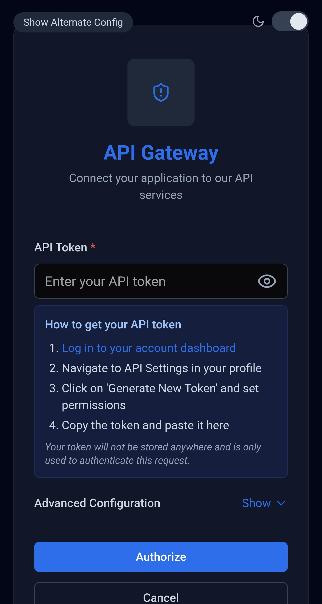
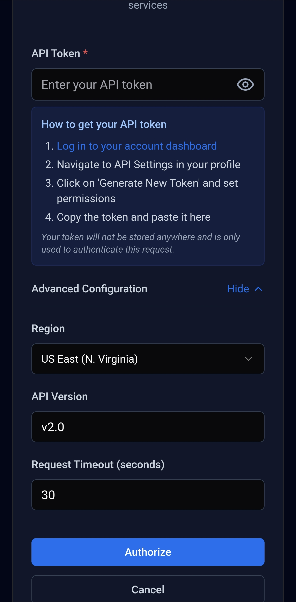
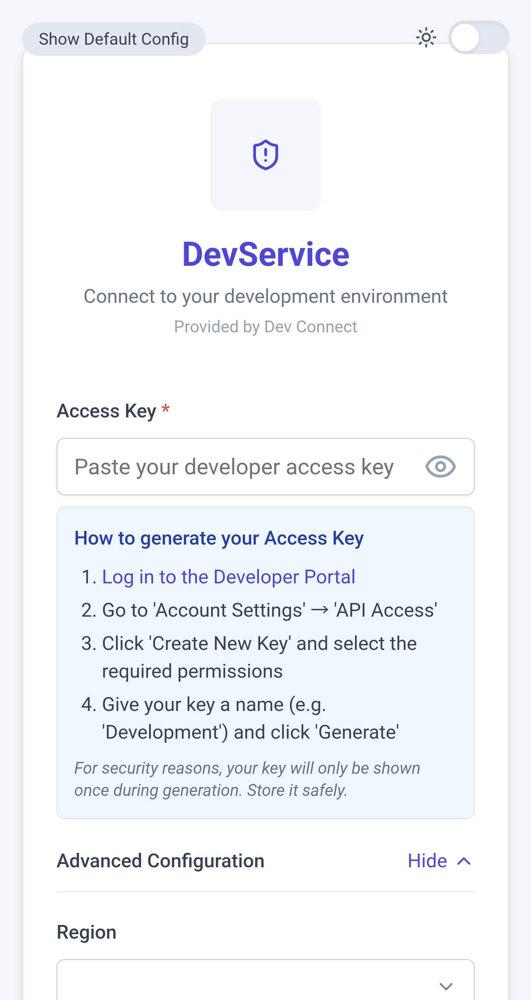

<div align="center">
  <h1>OAuth Consent Screen</h1>
  <p>A beautiful, customizable OAuth-style consent screen with API token input and branding options</p>
  
  
  
  
</div>

<div align="center">
  
  
  
</div>

<div align="center">
  <em>The OAuth Consent Screen component in dark mode, advanced configuration, and light mode</em>
</div>

<br />

## ✨ Features

- **Fully Customizable**: Configure your branding, colors, text, and behavior easily
- **Dark Mode Support**: Built-in light/dark theme with system preference detection
- **API Key Instructions**: Show step-by-step instructions for obtaining API keys
- **Advanced Settings**: Configurable fields for region, API version, and timeouts
- **Form Validation**: Validates inputs with customizable error messages
- **Responsive Design**: Looks great on all screen sizes
- **TypeScript Support**: Fully typed for better developer experience
- **Shadcn UI Components**: Beautiful design using Shadcn UI components
- **Tailwind CSS**: Styled with Tailwind CSS for easy customization

## 📦 Installation

```bash
# Using npm
npm install oauth-consent-screen

# Using yarn
yarn add oauth-consent-screen

# Using pnpm
pnpm add oauth-consent-screen
```

## 🚀 Quick Start

```jsx
import { ConsentScreen } from 'oauth-consent-screen';

function App() {
  return (
    <ConsentScreen 
      config={{
        branding: {
          companyName: "My API",
          serviceDescription: "Connect to our API service"
        },
        onSubmit: (data) => {
          console.log("Token submitted:", data.apiToken);
          // Handle authentication
        }
      }}
    />
  );
}

export default App;
```

## 📖 Documentation

### Basic Props

| Prop | Type | Description |
|------|------|-------------|
| `config` | `ConsentScreenConfig` | Main configuration object |
| `showDemoControls` | `boolean` | Optional. Shows demo configuration toggle for demonstration |

### Configuration Object

The `config` prop expects a `ConsentScreenConfig` object with the following properties:

```typescript
type ConsentScreenConfig = {
  branding: BrandingConfig;
  apiTokenLabel?: string;
  apiTokenPlaceholder?: string;
  advancedConfigLabel?: string;
  showAdvancedByDefault?: boolean;
  regions?: RegionOption[];
  enableThemeToggle?: boolean;
  defaultTheme?: 'light' | 'dark' | 'system';
  submitButtonText?: string;
  cancelButtonText?: string;
  defaultApiVersion?: string;
  defaultTimeout?: number;
  showRegionSelector?: boolean;
  showApiVersionField?: boolean;
  showTimeoutField?: boolean;
  apiKeyInstructions?: ApiKeyInstructionConfig;
  customStyles?: {
    cardWidth?: string;
    borderRadius?: string;
    shadowIntensity?: 'light' | 'medium' | 'heavy';
  };
  onSubmit?: (data: ConsentFormData) => void;
  onCancel?: () => void;
};
```

### Branding Configuration

```typescript
type BrandingConfig = {
  companyName: string;
  companyLogo?: string | React.ReactNode;
  serviceDescription: string;
  serviceProvider?: string;
  primaryColor?: string;
  backgroundColor?: string;
  headerBackground?: string;
};
```

### API Key Instructions

```typescript
type ApiKeyInstructionConfig = {
  show: boolean;
  title?: string;
  steps?: Array<{
    text: string;
    url?: string;
  }>;
  additionalInfo?: string;
};
```

### Form Data

The `onSubmit` callback receives a `ConsentFormData` object:

```typescript
type ConsentFormData = {
  apiToken: string;
  region?: string;
  apiVersion?: string;
  timeout?: number;
};
```

## 💡 Usage Examples

### 1. Basic Example with Custom Branding

```jsx
import { ConsentScreen } from 'oauth-consent-screen';

function AuthScreen() {
  return (
    <ConsentScreen 
      config={{
        branding: {
          companyName: "CloudAPI",
          serviceDescription: "Connect your application to our cloud services",
          primaryColor: "#0070f3", // Custom blue color
          companyLogo: "https://your-company.com/logo.png"
        },
        submitButtonText: "Connect",
        cancelButtonText: "Go Back",
        onSubmit: (data) => {
          console.log("API token received:", data.apiToken);
          // Handle authentication logic
        },
        onCancel: () => {
          console.log("Authentication cancelled");
          // Handle cancellation
        }
      }}
    />
  );
}
```

### 2. Advanced Configuration with API Key Instructions

```jsx
import { ConsentScreen } from 'oauth-consent-screen';

function FullFeaturedAuthScreen() {
  return (
    <ConsentScreen 
      config={{
        branding: {
          companyName: "Developer API",
          serviceDescription: "Access the Developer API tools",
          serviceProvider: "DevTools Inc.",
          primaryColor: "#6d28d9"
        },
        apiTokenLabel: "Developer Token",
        apiTokenPlaceholder: "Paste your developer token here",
        advancedConfigLabel: "API Settings",
        showAdvancedByDefault: true,
        regions: [
          { value: "us", label: "United States" },
          { value: "eu", label: "Europe" },
          { value: "asia", label: "Asia Pacific" }
        ],
        enableThemeToggle: true,
        defaultTheme: 'system',
        defaultApiVersion: "v2.1",
        defaultTimeout: 60,
        apiKeyInstructions: {
          show: true,
          title: "How to get your Developer Token",
          steps: [
            {
              text: "Log in to the Developer Portal",
              url: "https://developers.example.com/login"
            },
            { text: "Go to 'API Access' in your account settings" },
            { text: "Click 'Generate New Token'" },
            { text: "Copy the token and paste it here" }
          ],
          additionalInfo: "Your token is sensitive. Never share it in public places."
        },
        customStyles: {
          cardWidth: "max-w-lg",
          borderRadius: "rounded-xl",
          shadowIntensity: 'heavy'
        },
        onSubmit: (data) => {
          console.log("Form data:", data);
          // Process authentication
        }
      }}
    />
  );
}
```

### 3. Using with React Router

```jsx
import { useNavigate } from 'react-router-dom';
import { ConsentScreen } from 'oauth-consent-screen';

function AuthWithRouter() {
  const navigate = useNavigate();
  
  const handleSubmit = (data) => {
    // Store the token
    localStorage.setItem("api_token", data.apiToken);
    // Redirect to dashboard
    navigate('/dashboard');
  };
  
  const handleCancel = () => {
    // Redirect to home
    navigate('/');
  };
  
  return (
    <ConsentScreen 
      config={{
        branding: {
          companyName: "RouterApp",
          serviceDescription: "Authorize API access"
        },
        onSubmit: handleSubmit,
        onCancel: handleCancel
      }}
    />
  );
}
```

## 🧩 Dependencies

This component uses [Shadcn UI](https://ui.shadcn.com/) components and [Tailwind CSS](https://tailwindcss.com/). Please see `shadcn-dependencies.md` for information on how to set up the required components in your project.

## 🛠️ Development

Want to contribute to this component? Here's how to set up the development environment:

1. Clone the repository
   ```bash
   git clone https://github.com/yourusername/oauth-consent-screen.git
   cd oauth-consent-screen
   ```

2. Install dependencies
   ```bash
   npm install
   ```

3. Run the development server
   ```bash
   npm run dev
   ```

4. Build the package
   ```bash
   npm run build
   ```

## 📋 Requirements

- React 18 or higher
- TypeScript 5 or higher
- Tailwind CSS 3 or higher
- The appropriate Shadcn UI components

## 📄 License

MIT © [Your Name]

---

<div align="center">
  <p>Made with ❤️ for the developer community</p>
</div>